# Dissertation
My master Dissertation in NTU
* It is an NLP related dissertation
* The topic is Online News Analytics based on AI Techniques
* The main content is to collect a natural disaster dataset and perform news classification tasks on different feature representation methods and classifier

## Usage

* 📃 Dataset：

  ​	BBC_news is an dataset contains news from bbc website.

  ​	disaster_news_dataset.csv is the collected dataset about natrual disaster.

  ​	path:  code/dataset/disaster_news_dataset.csv

  ​	content:

  ​    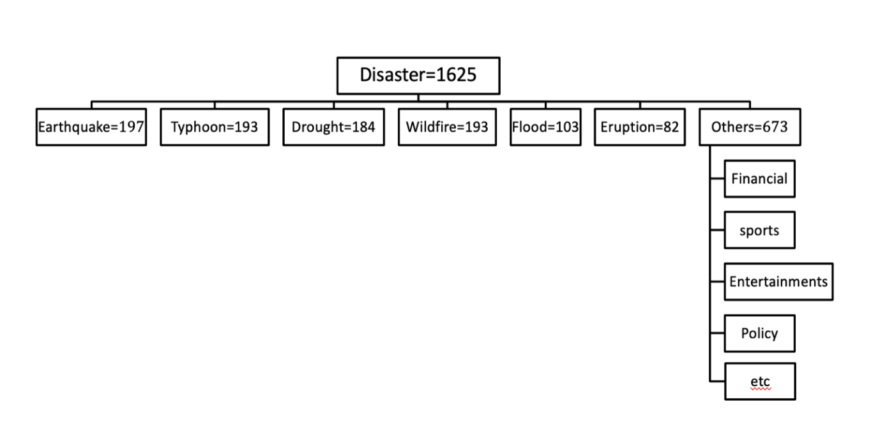

  ​	Distribution:

  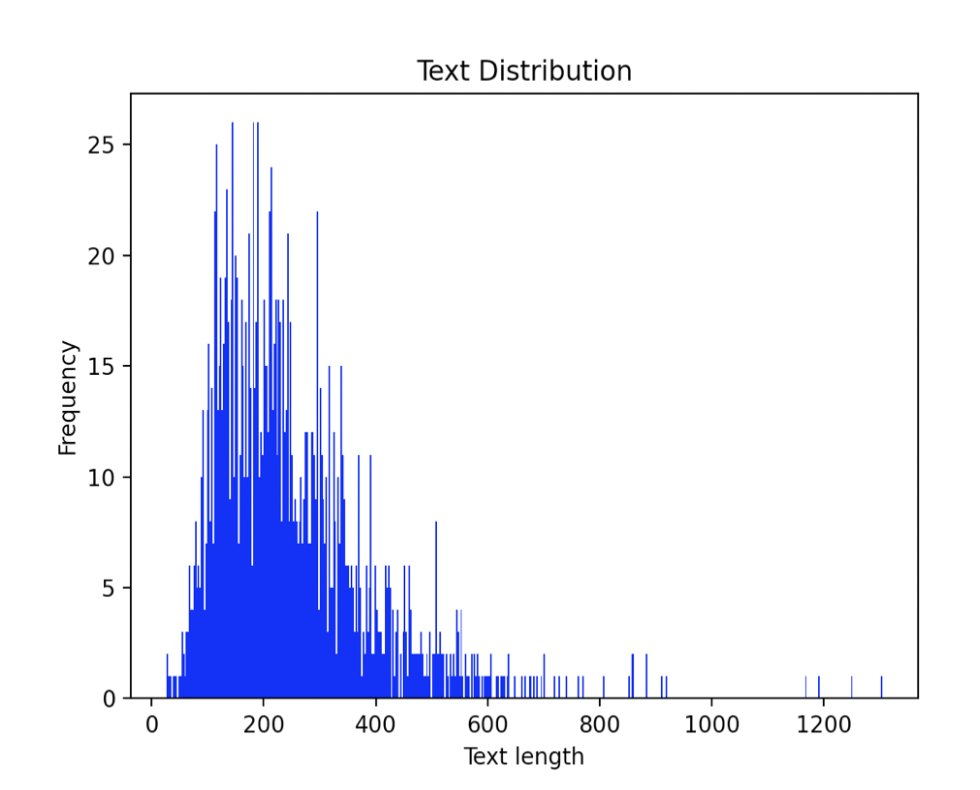

  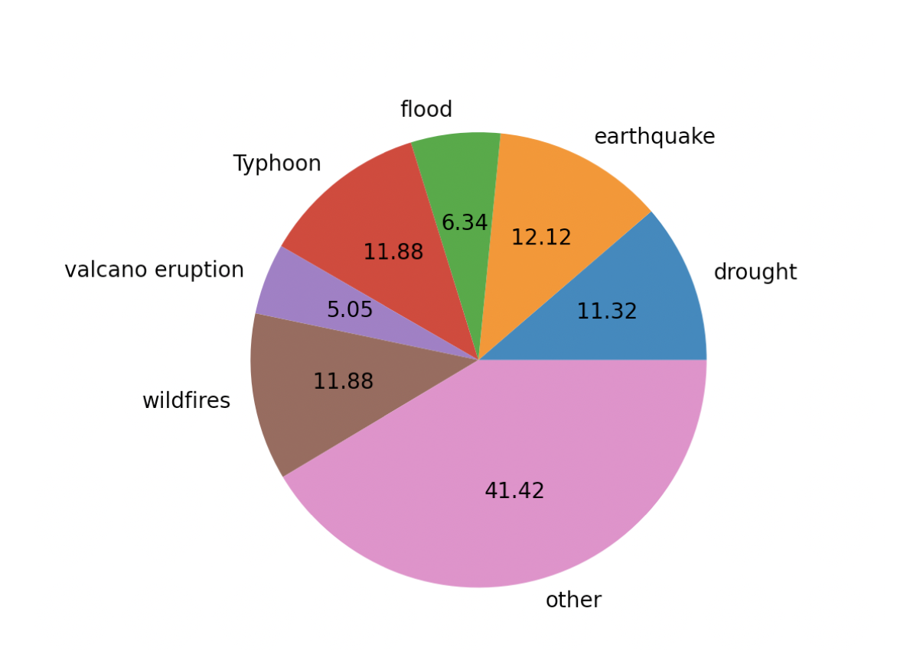

  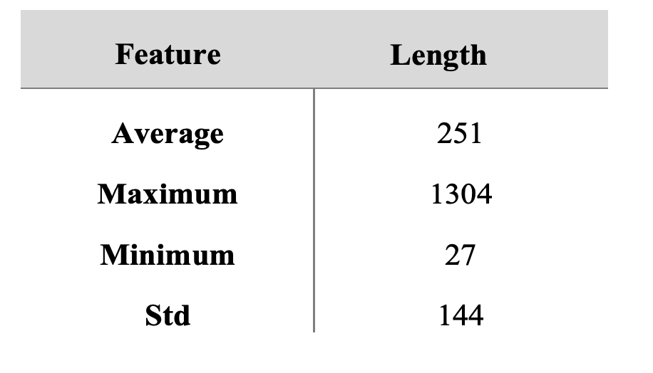

  ​		data_extraction.py:  is used to separate the dataset into test_set,trainning_set and validation_set. you might have to change the loading path before you use.

  ​		build_w2v.py: is to transfer the word2vec to the type that could be used in model.  **<u>You should download GoogleNews-vectors-negative300.bin before using this py</u>**

* 🕸️Bow+LR

  ​	path: code/bow+LR

  ​	train and test command : **python3 main.py** 	

  ​	test criteria is: accuracy, precise,recall,f1-score.

* 🕸️Bow+SVM

  ​	path: code/bow+SVM

  ​	train and test command : **python3 main.py** 	

  ​	test criteria is: accuracy, precise,recall,f1-score.

* 🕸️Bow+Feed-forward

  ​	path: code/bow+feedforward

  ​	train and test command : **python3 main.py** 	

  ​	test criteria is: accuracy, precise,recall,f1-score.

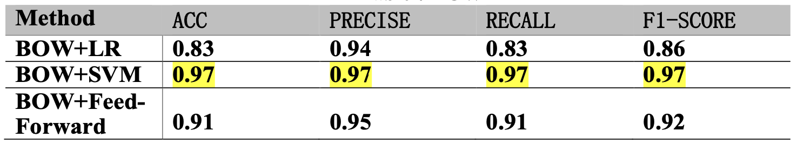

* 🕸️TF-IDF+LR

  ​	path: code/bow+LR

  ​	modify the code to use TF-IDF

  ​	train and test command : **python3 main.py** 	

  ​	test criteria is: accuracy, precise,recall,f1-score.

* 🕸️TF-IDF+SVM

  ​	path: code/bow+SVM

  ​	modify the code to use TF-IDF

  ​	train and test command : **python3 main.py** 	

  ​	test criteria is: accuracy, precise,recall,f1-score.

* 🕸️TF-IDF+Feed-forward

  ​	path: code/bow+feedforward

  ​	modify the code to use TF-IDF

  ​	train and test command : **python3 main.py** 	

  ​	test criteria is: accuracy, precise,recall,f1-score.

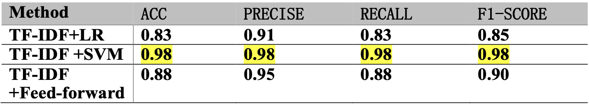

* 🕸️LDA+LR

  ​	path: code/LDA+LR

  ​	train and test command : **python3 main.py** 	

  ​	test criteria is: accuracy, precise,recall,f1-score.

* 🕸️LDA+SVM

  ​	path: code/LDA+SVM

  ​	train and test command : **python3 main.py** 	

  ​	test criteria is: accuracy, precise,recall,f1-score.

* 🕸️LDA+Feed-forward

  ​	path: code/LDA+feedforward

  ​	train and test command : **python3 main.py** 	

  ​	test criteria is: accuracy, precise,recall,f1-score.

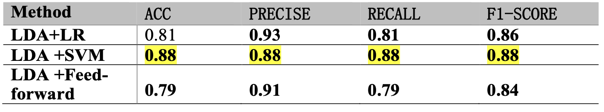

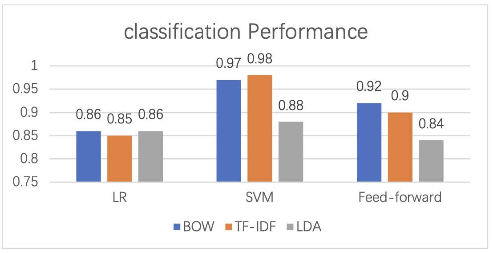

* 🕸️ Text-CNN：

  ​	path：code/text_cnn

  ​	train and test command : **python main.py** 

  ​	test criteria is: accuracy, precise,recall,f1-score.

  ​	you can modify the code to use non-pretrain embedding / word2vec embedding /glove embedding	

  ​	**you should download glove.840B.300d.txt and put it in correct path before you use it.**

* 🕸️ LSTM：

  ​	path: code/lstm

  ​	train and test command : **python main.py** 	

  ​	test criteria is: accuracy, precise,recall,f1-score.

  ​	you can also modify the code to use non-pretrain embedding / word2vec embedding /glove embedding	    

  ​	when using non-pretrain embedding, you might have to modify the setting.py and model.py

  ​	**you should download glove.840B.300d.txt and put it in correct path before you use it.**

* 🕸️ Transformer：

  ​	based on huggingface transformer

  ​	path: code/transformer

  ​	train and test command: 

  ```
  export TASK_NAME=test_classifify
  python run_glue.py \
    --model_name_or_path bert-base-cased \
    --train_file ../dataset/training_set.csv \
    --validation_file ../dataset/validation_set.csv \
    --test_file ../dataset/test_set.csv \
    --do_train \
    --do_eval \
    --do_predict \
    --max_seq_length 256 \
    --per_device_train_batch_size 8 \
    --learning_rate 2e-5 \
    --num_train_epochs 32 \
    --overwrite_output_dir True \
    --output_dir ./$TASK_NAME/
  ```

  use Bert-base-case model to perform classification tasks;

* 🌟Other:

  ​	these models will be train 10 times to evaluate the mean performance by default, you can modify the code to change.

  

* 📖 Result：

  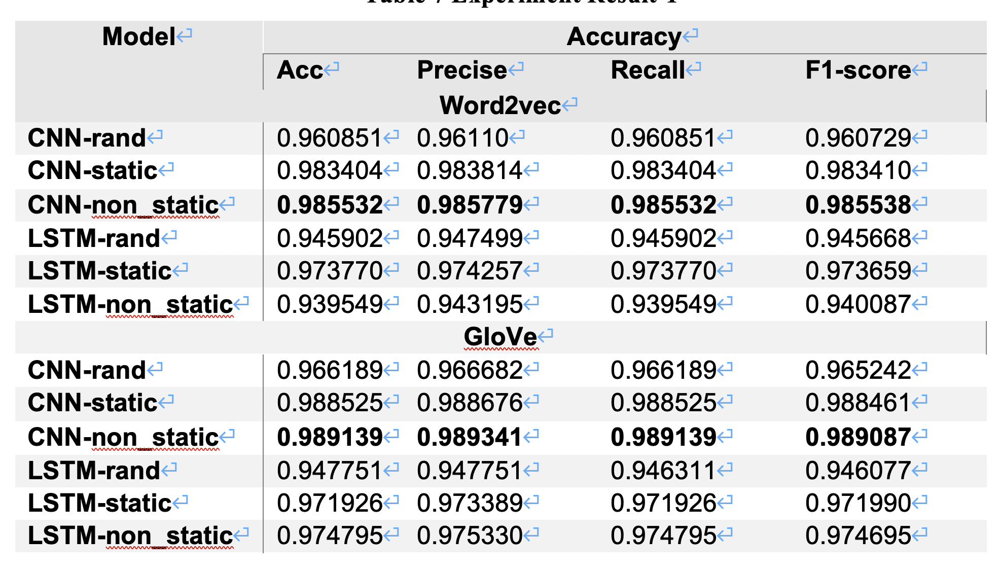

  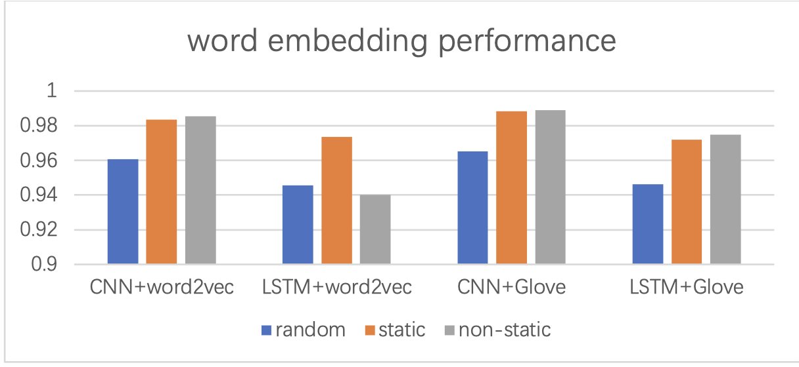

  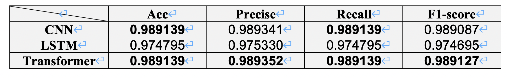

  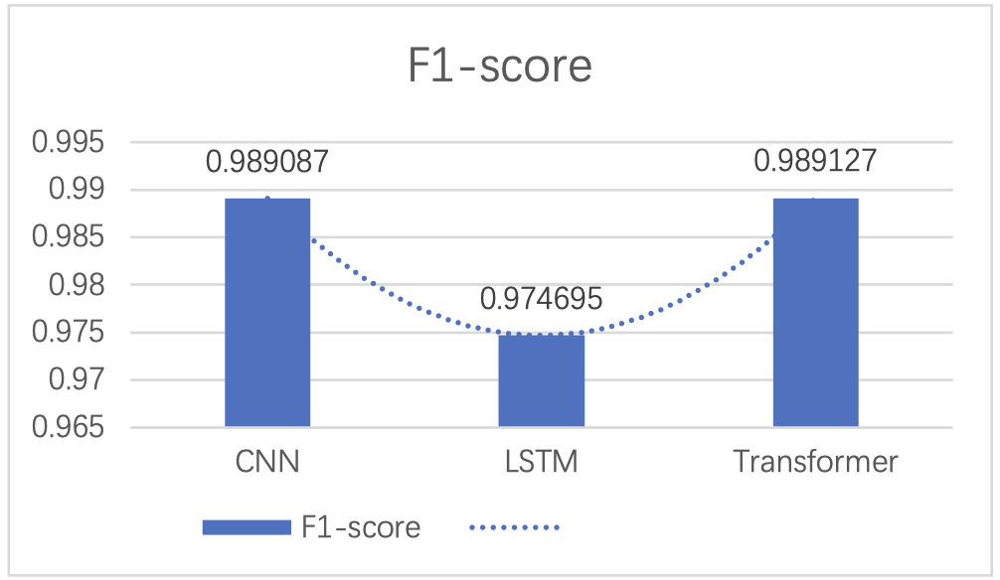